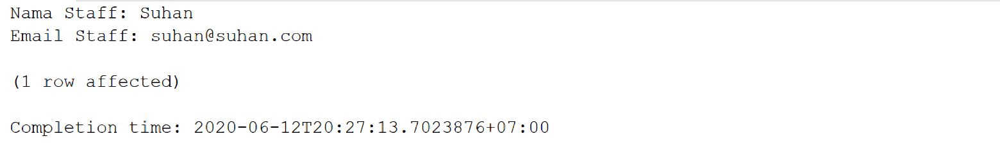
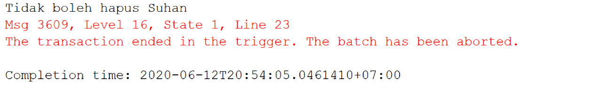
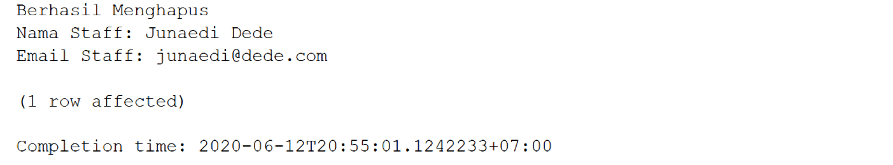
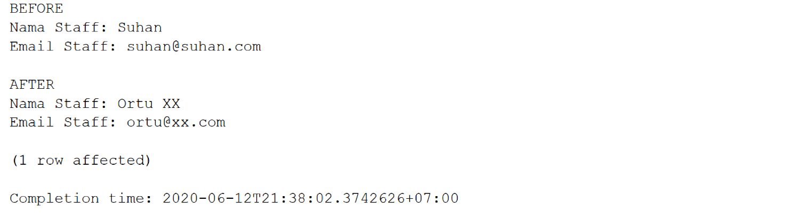

# TRIGGER

## Pengertian TRIGGER

Misalkan kita mempunyai teman, terus kita panggil nama orang tuanya..

Ari: "Oii Suhannn!!!"

XX : "Oii YYYYY (nama orang tua)"

Ketika Ari memanggil si XX dengan nama orang tuanya, maka si XX otomatis keTRIGGER memanggil nama orang tua saya. Jadi TRIGGER adalah sesuatu yang akan dilakukan ketika suatu event terjadi (simplenya begitu).

## Manfaat Trigger
1. Meluruskan aturan-aturan yang harus berlaku.
2. Menjaga nilai sebelum dimasukkan ke dalam database. 
3. Keamanan system.
4. Membuat historical record(riwayat perubahan).
5. Dan lain-lain

## Jenis Jenis Event Trigger
Event event di bawah ini bisa digunakan untuk memicu TRIGGER
1. Insert
2. Delete
3. Update

## Timeline Trigger
| Timeline | Arti |
|-|-|
| AFTER / FOR | TRIGGER akan terpicu setelah menjalankan INSERT, UPDATE atau DELETE |
| INSTEAD OF | Ini aku kurang dapat artinya sebenarnya. Coba kalian cek detailnya di sini http://bit.do/create_trigger_help |

## Virtual Table
Ketika kita memicu sebuah TRIGGER, database akan membuat sebuah tabel virtual untuk melakukan pengecekan data. Di mana tabel virtual tersebut adalah
| Table Name | Arti |
|-|-|
| INSERTED | Nama tabel virtual yang dibuat ketika kita melakukan sebuah insert/update |
| DELETED | Nama tabel virtual yang dibuat ketika kita melakukan sebuah delete/update |

Supaya lebih mengerti silahkan baca syntax dan contoh-contoh di bawah.

## Syntax

### INISIALISASI

```
    CREATE TRIGGER nama_trigger
    ON nama_table
    timeline event
    AS
    transact_sql
```

### MENGHAPUS TRIGGER
```
    DROP TRIGGER nama_trigger
```

## Contoh

Di sini kita akan membuat contoh-contoh menggunakan Trigger pada tabel MsStaff

### INSERT TRIGGER

#### Case:

Setelah selesai menginsert seorang staff, maka kita harus menampilkan data staff baru tersebut dengan format

```
    Nama Staff: @namaStaff
    Email Staff: @emailStaff
```

#### Jawaban:

```
    CREATE TRIGGER ShowNewStaffData
    ON MsStaff
    AFTER INSERT
    AS
        DECLARE @namaStaff VARCHAR(255), @emailStaff VARCHAR(255)
        SELECT
            @namaStaff = StaffName,
            @emailStaff = StaffEmail
        FROM INSERTED
        PRINT 'Nama Staff: ' + @namaStaff
        PRINT 'Email Staff: ' + @emailStaff
```
Sekarang kita coba insert

```
    INSERT INTO MsStaff
    VALUES('ST019', 'Suhan', 'suhan@suhan.com', 5000000, '1960-08-08')
```

Maka di output akan terdapat print begini




#### Penjelasan

| Syntax | Penjelasan |
|-|-|
| CREATE TRIGGER ShowNewStaffData ON MsStaff | Membuat Trigger dengan nama ShowNewStaffData pada tabel MsStaff |
| AFTER INSERT | Trigger akan terpicu setelah melakukan INSERT pada tabel MsStaff |
| DECLARE @namaStaff VARCHAR(255), @emailStaff VARCHAR(255) | Mendeklarasikan variabel @namaStaff dan @emailStaff |
| SELECT @namaStaff = StaffName, @emailStaff = StaffEmail FROM INSERTED | Karena kita melakukan INSERT, maka akan terbuat sebuah tabel virtual dengan nama INSERTED dan kita memasukkan nilainya ke masing-masing variabel yang sudah kita dekalarasikan |
| PRINT xxxx | Melakukan PRINT biasa |

### DELETE TRIGGER

#### Case:

setelah melakukan DELETE, pastikan nama Staffnya bukan "Suhan" (sesuai yang kita insert tadi)

Kalau yang dihapus adalah Suhan, tampilkan pesan error dan ROLLBACK. Jika tidak, tampilkan data yang dibuang seperti format di bawah
```
    Nama Staff: @namaStaff
    Email Staff: @emailStaff
```

#### Jawaban:

```
    CREATE TRIGGER ShowDeletedStaffData
    ON MsStaff
    AFTER DELETE
    AS
        BEGIN TRAN
        DECLARE @namaStaff VARCHAR(255), @emailStaff VARCHAR(255)
        SELECT
            @namaStaff = StaffName,
            @emailStaff = StaffEmail
        FROM DELETED
        IF @namaStaff = 'Suhan'
            BEGIN
                PRINT 'Tidak boleh hapus Suhan'
                ROLLBACK
            END
        ELSE
            BEGIN
                PRINT 'Berhasil Menghapus'
                PRINT 'Nama Staff: ' + @namaStaff
                PRINT 'Email Staff: ' + @emailStaff
            END
```
Sekarang kita coba delete

```
    DELETE FROM MsStaff
    WHERE StaffID = 'ST019' #SEBAGAIMANA YANG KITA INSERT TADI
```

Otomatis output akan menjadi seperti ini




Sekarang kita coba jalankan
```
    DELETE FROM MsStaff
    WHERE StaffID = 'ST018'
```

Dan outputnya sekarang menjadi begini



#### Penjelasan
| Syntax | Penjelasan |
|-|-|
| CREATE TRIGGER ShowDeletedStaffData ON MsStaff | Membuat Trigger dengan nama ShowDeletedStaffData pada tabel MsStaff |
| AFTER DELETE | Trigger akan terpicu setelah melakukan DELETE pada tabel MsStaff |
| BEGIN TRAN | Ibarat membuat checkpoint, jadi kalau ada apa-apa, kita bisa rollback untuk kembali ke checkpoint tersebut |
| DECLARE @namaStaff VARCHAR(255), @emailStaff VARCHAR(255) | Mendeklarasikan variabel @namaStaff dan @emailStaff |
| SELECT @namaStaff = StaffName, @emailStaff = StaffEmail FROM DELETED | Karena kita melakukan DELETE, maka akan terbuat sebuah tabel virtual dengan nama DELETED dan kita memasukkan nilainya ke masing-masing variabel yang sudah kita dekalarasikan |
| PRINT xxxx | Melakukan PRINT biasa |
| ROLLBACK | Kembali ke checkpoint, jadi sebenarnya data kita sudah terhapus, tapi karena checkpoint kita berada di state di mana data belum terhapus, maka kita akan kembali ke state tersebut supaya "Suhan" tidak terhapus. |


### UPDATE TRIGGER

```
    PERHATIKAN TERLEBIH DAHULU!
    UPDATE ADALAH KOMBINASI DARI DELETE DAN INSERT

    DI MANA DATA YANG DULU KITA UPDATE DAHULU
    KEMUDIAN DATA YANG BARU KITA INSERT

    MAKA VIRTUAL TABLE YANG DIBUAT JUGA ADA 2
    DELETED UNTUK DATA YANG DIHAPUS (DATA SEBELUMNYA)
    INSERTED UNTUK DATA YAGN BARU
```


#### Case:

setelah melakukan UPDATE, tampilkan data sebelum dan setelah di UPDATE

Ketika sudah diUPDATE, tampilkan datanya dengan format di bawah
```
    BEFORE
    Nama Staff: @namaStaffBefore
    Email Staff: @emailStaffBefore

    AFTER
    Nama Staff: @namaStaffAfter
    Email Staff: @emailStaffAfter
```

#### Jawaban:

```
    CREATE TRIGGER ShowUPDATEDStaffData
    ON MsStaff
    AFTER DELETE
    AS
        BEGIN TRAN
        DECLARE @namaStaffBefore VARCHAR(255), @emailStaffBefore VARCHAR(255)
        DECLARE @namaStaffAfter VARCHAR(255), @emailStaffAfter VARCHAR(255)
        SELECT
            @namaStaffBefore = StaffName,
            @emailStaffBefore = StaffEmail
        FROM DELETED
        SELECT
            @namaStaffAfter = StaffName,
            @emailStaffAfter = StaffEmail
        FROM INSERTED
            PRINT 'BEFORE'
            PRINT 'Nama Staff: ' + @namaStaffBefore
            PRINT 'Email Staff: ' + @emailStaffBefore
            PRINT ''
            PRINT 'AFTER'
            PRINT 'Nama Staff: ' + @namaStaffAfter
            PRINT 'Email Staff: ' + @emailStaffAfter
```

Sekarang kita coba update

```
    UPDATE MsStaff
    SET
        StaffName = 'Ortu XX',
        StaffEmail = 'ortu@xx.com'
    WHERE StaffID = 'ST019'
```

Dan outputnya sekarang menjadi begini



#### Penjelasan
| Syntax | Penjelasan |
|-|-|
| CREATE TRIGGER ShowDeletedStaffData ON MsStaff | Membuat Trigger dengan nama ShowDeletedStaffData pada tabel MsStaff |
| AFTER DELETE | Trigger akan terpicu setelah melakukan DELETE pada tabel MsStaff |
| BEGIN TRAN | Ibarat membuat checkpoint, jadi kalau ada apa-apa, kita bisa rollback untuk kembali ke checkpoint tersebut |
| DECLARE @namaStaffBefore VARCHAR(255), @emailStaffBefore VARCHAR(255) | Mendeklarasikan variabel @namaStaffBefore dan @emailStaffBefore |
| SELECT @namaStaffBefore = StaffName, @emailStaffBefore = StaffEmail FROM DELETED | Data lama akan berada di tabel virtual DELETED dan kita memasukkan nilainya ke masing-masing variabel |
| DECLARE @namaStaffAfter VARCHAR(255), @emailStaffAfter VARCHAR(255) | Mendeklarasikan variabel @StaffAfter dan @emailStaffAfter |
| SELECT @namaStaffAfter = StaffName, @emailStaffAfter = StaffEmail FROM INSERTED | Data baru akan berada di tabel virtual INSERTED dan kita memasukkan nilainya ke masing-masing variabel |
| PRINT xxxx | Melakukan PRINT biasa |