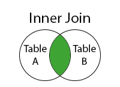
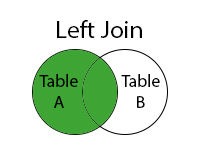
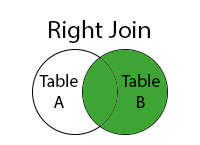
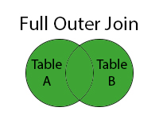

# JOIN
Seperti namanya sendiri, Join artinya bergabung. Dalam database, Join ini berguna untuk menggabungan 2 tabel atau lebih berdasarkan KEY tertentu (Biasanya adalah Foreign Key di suatu tabel dan Primary Key di tabel lainnya, tapi bisa juga yang lain).

## Syntax Join
Untuk melakukan Join, kita harus menggunakan syntax yaitu **JOIN** dengan format:
```
    ...
    
    FROM TableA (JENIS JOIN) TableB ON TableA.Key = TableB.key
    
    ...
```

## Tabel yang akan kita gunakan (Source w3schools.com)

### Order
| OrderID | CustomerID | OrderDate |
| ------- | ---------- | --------- |
| 10308 | 2 | 1996-09-18 |
| 10309 | 37 | 1996-09-19 |
| 10310 | 77 | 1996-09-20 |
| 10311 | 2 | 1996-09-21 |

### Customer
| CustomerID | CustomerName | ContactName | Country |
| ---------- | ------------ | ----------- | ------- |
| 1 | Alfreds Futterkiste | Maria Anders | Germany |
| 2 | Ana Trujillo Emparedados y helados | Ana Trujillo | Mexico |
| 3 | Antonio Moreno Taquería | Antonio Moreno | Mexico |


## Jenis-Jenis Join
**Join** terdiri dari beberapa jenis:
  ### Inner Join
  
  Berdasarkan gambar di atas, kita mendapati bahwa Inner Join hanya akan menampilkan data yang benar-benar terhubung. Maksudnya adalah Key dari TableA terdapat di TableB juga.
  Ex:
  ```
    SELECT * 
    FROM
        Order o
        JOIN Customer c on c.CustomerID = o.CustomerID
  ```
  Di table **Order**, CustomerID yang terdapat di tabel **Customer** adalah *2*, maka outputnya adalah
  | OrderID | CustomerID | OrderDate | CustomerID | CustomerName | ContactName | Country |
  | ------- | ---------- | --------- | ---------- | ------------ | ----------- | ------- |
  | 10308 | 2 | 1996-09-18 | 2 | Ana Trujillo Emparedados y helados | Ana Trujillo | Mexico |
  | 10311 | 2 | 1996-09-21 | 2 | Ana Trujillo Emparedados y helados | Ana Trujillo | Mexico |

  ### Left Join
  
  **Left Join** sendiri, akan menampilakn semua data yang ada di sebelah kiri, dan jikalau Key yang dicocokkan ada di tabel sebelah kanan, maka data tabel sebelah kanan akan ditampilkan, jika tidak maka akan dijadikan NULL.
  Ex:
  ```
    SELECT * 
    FROM
        Order o
        LEFT JOIN Customer c on c.CustomerID = o.CustomerID
  ```
  Tabel sebelah kiri adalah **Order** dan sebelah kanan adalah **Customer**, karena CustomedID 33 dan 77 tidak terdapat di tabel **Customer**, maka data Customer pada Order tersebut akan dijadikan NULL.
  | OrderID | CustomerID | OrderDate | CustomerID | CustomerName | ContactName | Country |
  | ------- | ---------- | --------- | ---------- | ------------ | ----------- | ------- |
  | 10308 | 2 | 1996-09-18 | 2 | Ana Trujillo Emparedados y helados | Ana Trujillo | Mexico |
  | 10309 | 37 | 1996-09-19 | NULL | NULL | NULL | NULL |
  | 10310 | 77 | 1996-09-20 | NULL | NULL | NULL | NULL |
  | 10311 | 2 | 1996-09-21 | 2 | Ana Trujillo Emparedados y helados | Ana Trujillo | Mexico |


  ### Right Join
  
  **Right Join** adalah kebalikan dari Left Join, jika tabel di sebelah kiri tidak mengandung key yang terdapat di tabel kedua, maka tabel sebelah kiri akan dikosongkan. Seandainya tabel sebelah kiri memiliki data yang mengandung key sebelah tabel kanan sebanyak lebih dari sama dengan 1, maka semua data itu akan ditampilkan.
  Ex:
  ```
    SELECT * 
    FROM
        Order o
        RIGHT JOIN Customer c on c.CustomerID = o.CustomerID
  ```
  Output:
  | OrderID | CustomerID | OrderDate | CustomerID | CustomerName | ContactName | Country |
  | ------- | ---------- | --------- | ---------- | ------------ | ----------- | ------- |
  | NULL | NULL | NULL | 1 | Alfreds Futterkiste | Maria Anders | Germany |
  | 10308 | 2 | 1996-09-18 | 2 | Ana Trujillo Emparedados y helados | Ana Trujillo | Mexico |
  | 10308 | 2 | 1996-09-18 | 2 | Ana Trujillo Emparedados y helados | Ana Trujillo | Mexico |
  | NULL | NULL | NULL | 3 | Antonio Moreno Taquería | Antonio Moreno | Mexico |

  ### Full Outer Join
  
  **Full Outer Join** adalah gabungan dari Left Join dan Right Join. Dia akan menampilkan Left Join terlebih dahulu kemudian di**UNION** Right Join dengan kondisi, data tersebut belum ada di Left Join Sebelumnya
  Ex:
  ```
    SELECT * 
    FROM
        Order o
        RIGHT JOIN Customer c on c.CustomerID = o.CustomerID
  ```
  Output:
  | OrderID | CustomerID | OrderDate | CustomerID | CustomerName | ContactName | Country |
  | ------- | ---------- | --------- | ---------- | ------------ | ----------- | ------- |
  | 10308 | 2 | 1996-09-18 | 2 | Ana Trujillo Emparedados y helados | Ana Trujillo | Mexico |
  | 10309 | 37 | 1996-09-19 | NULL | NULL | NULL | NULL |
  | 10310 | 77 | 1996-09-20 | NULL | NULL | NULL | NULL |
  | 10311 | 2 | 1996-09-21 | 2 | Ana Trujillo Emparedados y helados | Ana Trujillo | Mexico |
  | NULL | NULL | NULL | 1 | Alfreds Futterkiste | Maria Anders | Germany |
  | NULL | NULL | NULL | 3 | Antonio Moreno Taquería | Antonio Moreno | Mexico |