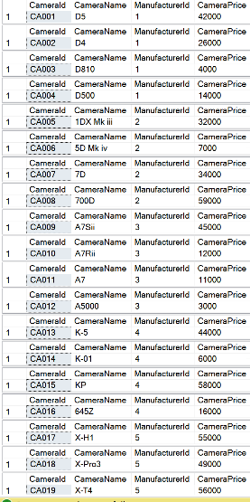
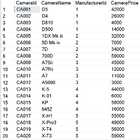

# Cursor

## Penjelasan Cursor

Cursor adalah objek database yang berguna untuk memanipulasi data dalam satu set per baris (bisa diibaratkan seperti looping). Biasanya kalau kita melakukan SELECT maka Database akan menampilkan data sekaligus.

### Perbedaan dengan SELECT
CURSOR



SELECT



## Jenis-Jenis Cursor

| Jenis Cursor | Pengertian |
|-|-|
| Forward Only | Seperti namanya, Cursor ini hanya bisa melakukan loopingan dari depan ke belakang |
| Static | Cursor jenis ini bisa melakukan loopingan dari depan maupun dari belakang, dengan cara melakukan caching terlebih dahulu |
| Dinamic | Memberikan akses penambahan, perubahan dan penghapusan data oleh user yang lain. |
| Keyset | Seperti dinamis, tetapi tidak dapat melihat penambahan oleh user lain. Dan juga menolak akses terhadap record yang user lain hapus. Perubahan data masih dapat dilihat |

### Jenis-Jenis FETCH
Sesuai namanya, FETCH berguna untuk mengambil data dari CURSOR.
| FETCH | Arti |
|-|-|
| NEXT | Mengembalikan baris setelah baris terakhir, misalkan kita FETCH yang kedua kalinya, maka data yang diambil adalah data kedua sebagaimana data pertama sudah diambil di FETCH yang pertama |
| PRIOR | Kebalikan dari NEXT, jika kita melakukan FETCH NEXT sebanyak 3 kali. Jika kita FETCH PRIOR, maka CURSOR akan menampilkan data yang kedua lagi. |
| FIRST | Mengembalikan data di baris pertama |
| LAST | Mengembalikan data di baris terakhir |
| ABSOLUTE | Mengembalikan baris ke-n dari baris ke-X. X akan bernilai awal jikalau n adalah bilangan bulat positif. X akan bernilai akhir jikalau n adalah bilangan bulat negatif. Jika n adalah 0 maka CURSOR tidak akan mengembalikan apa-apa. Contoh: mengambil data ke 3 dari belakang, maka FETCH ABSOLUTE -3 FROM nama_cursor |
| RELATIVE | Sama seperti ABSOLUTE, hanya saja kalau absolute mengambil data dari pertama atau terakhir, sedangkan RELATIVE mengambil data ke-n dari baris terakhir. Jadi kalau kita sudah FETCH NEXT sebanyak 3 kali, maka kalau kita FETCH RELATIVE 2 FROM nama_cursor, data yang diambil adalah data ke 5. Jikalau n adalah 0, maka CURSOR akan mengembalikan baris yang terakhir diakses. |

## Syntax Cursor

### Inisialisai

```
    DECLARE nama_cursor CURSOR
    jenis_cursor (kalau kosong, maka CURSOR menjadi tipe FORWARD ONLY)
    FOR
        select_statement
```

### Cara Menggunakan Cursor

```
    OPEN nama_cursor
        fetch / logic pengambilan data.
    CLOSE nama_cursor
```

### Menghapus

```
    DEALLOCATE nama_cursor
```

### Contoh
Kita akan mengambil semua data kamera dengan menggunakan CURSOR, maka syntaxnya adalah
```
    DECLARE ViewCameraCursor CURSOR 
    FOR
        SELECT * FROM MsCamera
    OPEN ViewCameraCursor
    FETCH NEXT FROM ViewCameraCursor
    WHILE @@FETCH_STATUS != -1
    BEGIN
        FETCH NEXT FROM ViewCameraCursor
    END
    CLOSE ViewCameraCursor
```

Pada awalnya kita memiliki sebuah cursor bernama *nama_cursor*, kemudian kita **OPEN** yang berarti kita akan mengambil data *nama_cursor*. 
Selanjutnya kita akan melakukan **FETCH NEXT FROM nama_cursor** yang berarti kita mengambil data, dan kita harus fetch sekali terlebih dahulu. Ketika kita FETCH pertama kali, maka cursor akan menampilkan row pertama dari *select_statement*
**CLOSE nama_cursor** berarti kita menutup cursornya, ibarat kita fopen dan fclose di C.
**WHILE @@FETCH_STATUS = X** berguna sebagai kondisi loopingan kita. 
| @@FETCH_STATUS | arti |
|-|-|
| 0 | FETCH statement berhasil dilakukan |
| -1 | FETCH statement gagal atau FETCH sudah mencapai akhir |
| -2 | baris yang di FETCH kosong |
| -9 | cursor tidak melakukan operasi FETCH |

Kalau kita ingin mengambil data ke 5, maka syntaxnya adalah
```
    OPEN ViewCameraCursor
        FETCH ABSOLUTE 5 FROM ViewCameraCursor
    CLOSE ViewCameraCursor
```